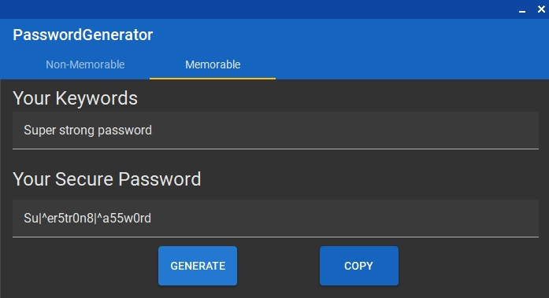
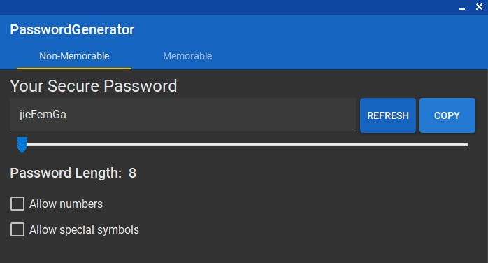
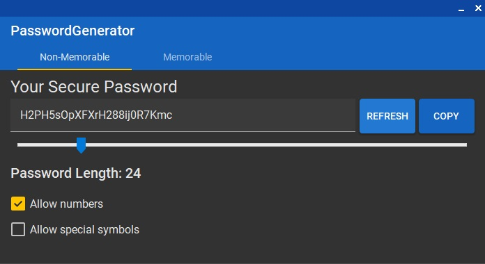
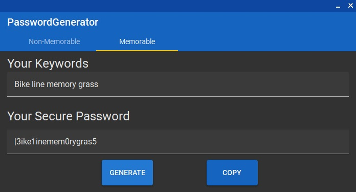

# Easy-to-remember password generator

## About the project
### A program for generating strong and easy-to-remember passwords based on keywords entered by the user

## Usage
### On the "Non-memorable" tab you can generate a strong password containing random symbols based on parameters such as: password length (up to 128 symbols), use of numbers or/and special symbols

### On the "Memorable" tab you can generate a strong password based on your keywords. Each character of your keywords will be encoded or not encoded into a character set that is visually recognizable as the corresponding character, so you only need to remember your keywords and the way how they are encoded

### There are several options of encoding character, so by clicking the "Generate" button you can change resulting password that you think is more memorable
